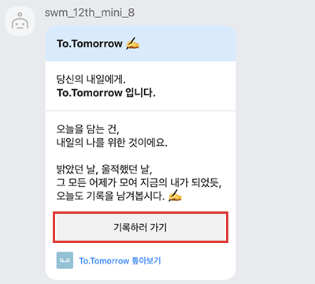
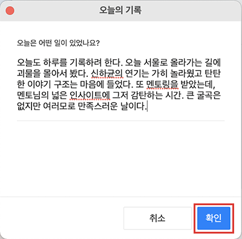
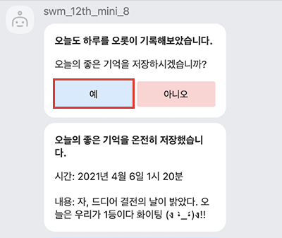
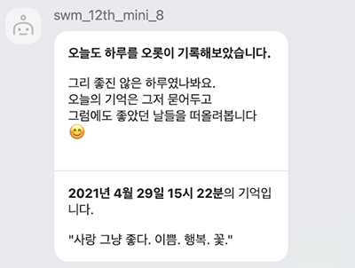
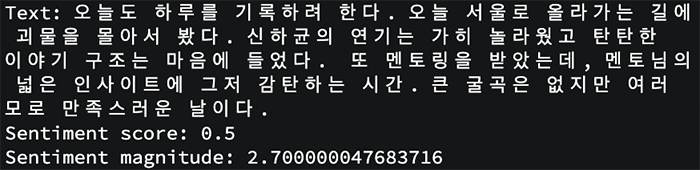
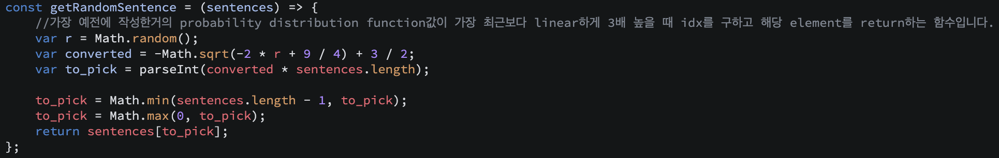

# To Tomorrow : 당신의 내일에게 ✍🏼

> 오늘을 담는 건, 내일의 나를 위한 것이에요. 
> 
> 밝았던 날, 울적했던 날, 그 모든 어제가 모여 지금의 내가 되었듯이
> 
> 오늘도 기록을 남겨봅시다.

[To.Tomorrow는?](#totomorrow는) • [To.Tomorrow 살펴보기](#totomorrow-살펴보기) • [To.Tomorrow 더보기](#totomorrow-더보기) • [팀 팔만대장경](#팀-팔만대장경)


## **To.Tomorrow**는? 

### 소개

- 다음과 같이 생각해보신 적 있나요? 🧐

```
- 소중했던 순간들이 잊혀질까 두려운가요?
- 누군가에게 위로받고 싶은 날이 있나요?
- 누군가와 함께 나누고 싶은 날이 있나요?
- 과거의 순간들을 기억해보고싶나요?
```

- 지금, 카카오워크 **To.Tomorrow** 에서 당신의 내일에게 오늘을 전해주세요.
- 조금은 지친 하루를 보냈다면, 좋았던 나의 기억을 떠올리며 위로받을 수 있어요.

### 주요 기능

- 매일 오늘 하루는 어땠는지 물어오는 메시지를 전송합니다.
- 사용자는 하루를 되돌아보며 **오늘의 기록**을 입력합니다.
- `Google Cloud Natural Language API` 를 이용하여 오늘의 기록 속 사용자의 감정을 파악합니다.
  - ☀️ **좋은 날**, 기억 속에만 묻어두기 아쉽다면 데이터베이스에 저장하여 돌아볼 수 있습니다.
  - ☁️ **지친 날**, 좋았던 하루를 떠올리며 과거의 나로부터 위로받을 수 있습니다.
- 기록하고 싶은 모든 순간, **To.Tomorrow** 에 언제든 기록을 남길 수 있습니다.


## To.Tomorrow 살펴보기

### 시나리오

1. **To Tomorrow 알림 메시지 ✉️**



- **To.Tomorrow** 의 메시지를 수신하였다면, **`기록하러 가기`** 버튼을 선택합니다.

2. **To.Tomorrow에 오늘을 기록하기** ✍🏼



- 오늘 하루 있었던 일을 되돌아보며 **기록을 작성**합니다.
- 작성 후, **`확인`** 버튼을 눌러 **오늘의 감정**을 파악합니다.

3-1. ☀️ **좋은 날을 보냈다면** ☀️



- 오늘의 기록이 **좋은 감정**으로 가득하다면, 저장 여부를 묻는 메시지를 수신합니다.
  - **`예`** 를 선택하면, 데이터베이스에 저장하여 미래의 내가 오늘의 기록을 다시 떠올릴 수 있습니다.
  - **`아니오`** 를 선택하면, 오늘 하루를 기분 좋게 마무리할 수 있습니다.
- 저장된 기록을 확인할 수 있습니다.

3-2. ☁️ **좋지 않은 날을 보냈다면** ☁️



- 오늘의 기록이 **지친 감정**을 동반하였다면, 위로의 메시지와 함께 **과거 나의 기록**을 함께 받아볼 수 있습니다.
- 좋았던 날의 기억을 생생히 떠올리며, 과거의 나로부터 지친 하루 끝 작은 위로를 받아볼 수 있습니다.

4. **기록이 끝난 후** 📤

- 언제든 오늘의 순간을 기록할 수 있도록, **To.Tomorrow** 의 메시지를 다시 받아 기록을 이어갈 수 있습니다.

## To.Tomorrow 더보기

### 구현 기능

1. **구글 클라우드 API를 사용한 감정 분석**

   

   - `Google Cloud Natural Language API` 를 이용하여 입력받은 오늘의 기록 속 감정을 분석합니다.
   - 오늘의 기록 속 감정을 분석하여 얻은 `sentiment score` 를 활용하였습니다.
     - `score` : 문서의 전반적인 정서를 나타냅니다.
       - 범위 :  **-1.0(부정적) ~ 1.0(긍정적)**
       - **지친 날** ~ **좋은 날**로 판단하였습니다.
     - `magnitude` : 문서에 얼마나 많은 감정이 담겨 있는지를 나타냅니다.
2. **Firebase 데이터베이스에 기록 저장 및 불러오기**

   - `Firebase` 를 사용하여 좋은 날의 기록을 저장합니다.
   - `saveMessage` 함수를 사용하여 **채팅방 id, 날짜, 기록** 을 저장합니다.
     - 채팅방 id로 사용자의 기록을 구분하여 저장합니다.
     - `moment-timezone` 모듈을 사용하여 `Asia/Seoul` 시간대로 설정하였습니다.

3. **과거 기록 전송하기**
   - `getRandomSentence` 함수를 사용하여 과거 좋은 날의 기록 중 하나를 무작위로 전송합니다.
   - 최근의 좋은 기억보다 시간이 더 흐른 좋은 기억을 돌아 볼 수 있도록 하였습니다.
     - 가장 오래된 기억의 `probability distribution function` 값이 가장 최근 기억보다 linear하게 3배 높을 때의 index를 구하여 해당 기억을 반환합니다.
     - 
     - (해당 함수 이미지)

### 사용 기술

- [goorm ide](https://ide.goorm.io/)
- [kakaowork API](https://docs.kakaoi.ai/kakao_work/)
- [Node.js](https://nodejs.org/)
- [Firebase](https://firebase.google.com/)
- [Google Cloud API](https://cloud.google.com/natural-language/docs/analyzing-sentiment)

## 팀 팔만대장경

- SW마에스트로 12기 미니 프로젝트
- 2021.04.19. ~ 2021.04.30.

@soheeeeKim @nyeok98 @Yoogeonhui @GuruneLee @NormalPlayerJSH @Jdoublee

8팀 팔만대장경의 To.Tomorrow를 이용해주셔서 감사합니다 :)

